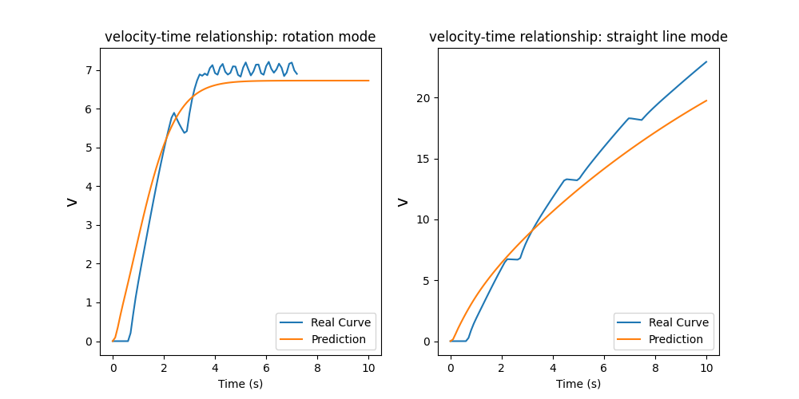
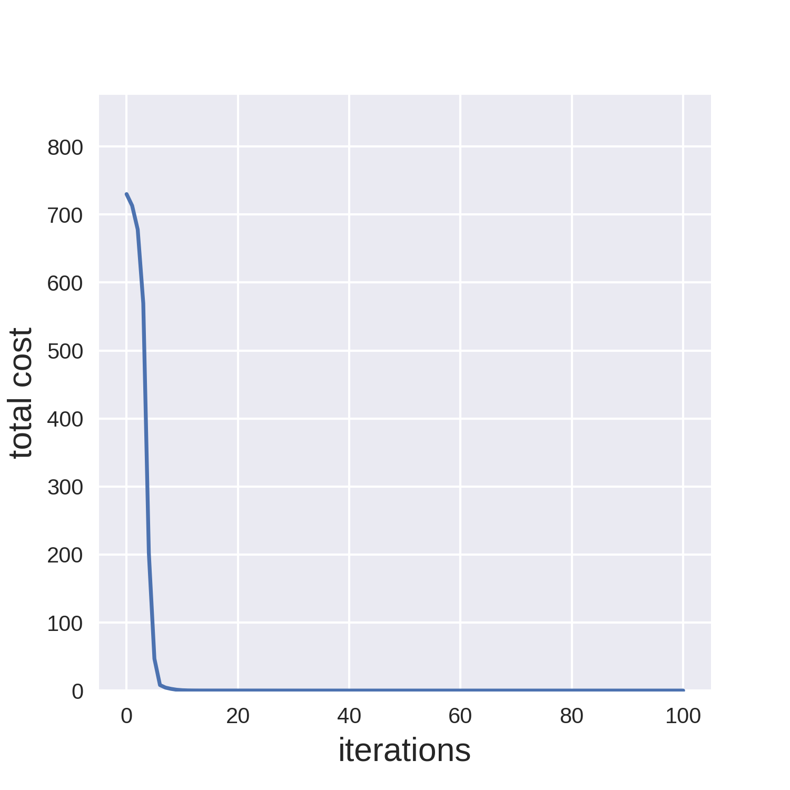
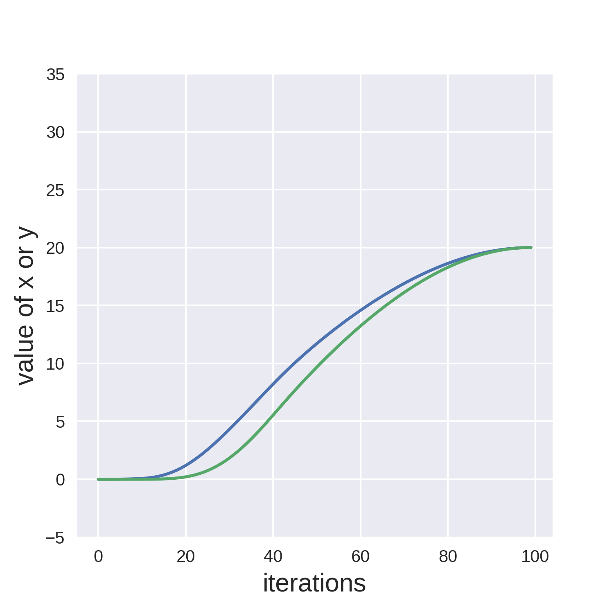
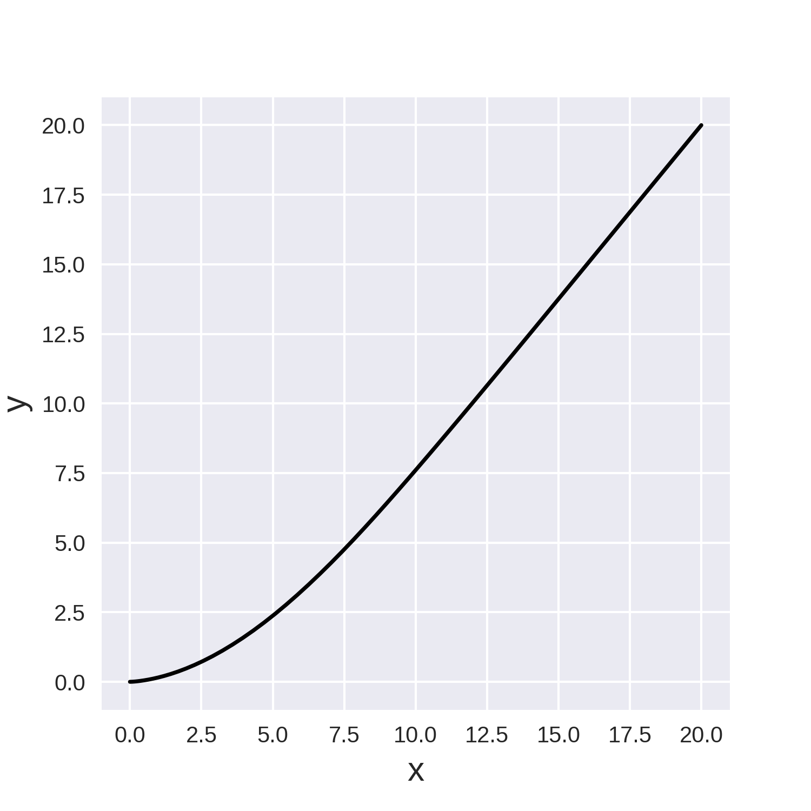
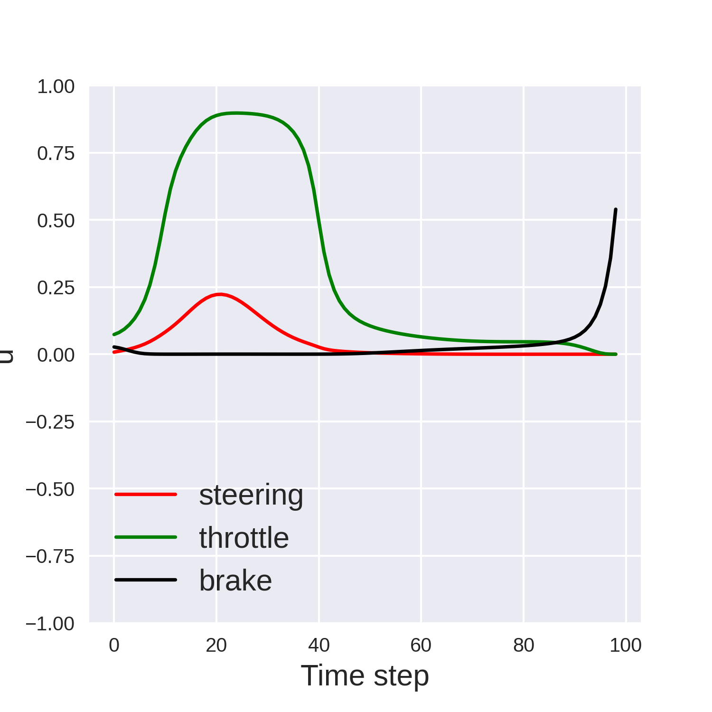
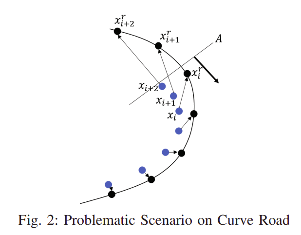

# Real-time MPC with iLQR for Self-Driving in Carla
> This project is an extension of my course project in [ES 202: Estimation and Control of Dynamical System](https://nali.seas.harvard.edu/classes/es-202-estimation-and-control-dynamical-system). 
I really appreciate the collaboration of my teammates: [En-Yu Yang](https://github.com/danielyang2055) and [Feicheng Wang](https://statistics.fas.harvard.edu/people/feicheng-want). 

The majority of self-driving implementations in Carla are model-free RL. To achieve higher sample efficiency, a model-based algorithm will be preferred, eg. iLQR. However, Carla doesn't provide a set of equations for the dynamical model, so the first step here is to collect data and fit a differentiable model. The next step is to incorporate the model into iLQR framework. Before running iLQR, we're required to define the cost function, eg. distance to the reference path, and constraints. Luckily, Carla has an API for planning routes represented by waypoints, and the range of control input is written in Carla document. The final MPC-iLQR algorithm will be run at 10Hz. 

Table of contents
=================

<!--ts-->
   * [1. Video Demonstration](#Video-Demonstration)
   * [2. Implementation Details](#Implementation-Details)
     * [2.1 System Identification](#System-Identification)
       * [2.1.1 Data Collection](#Data-Collection)
       * [2.1.2 Model Choice](#model-choice)
       * [2.1.3 Test](#test)
     * [2.2 iLQR](#ilqr)
       * [2.2.1 Why JAX: Choice of Automatic Differentiation Framework](#Why-JAX-Choice-of-Automatic-Differentiation-Framework)
       * [2.2.2 Input Constraint](#input-constraint)
       * [2.2.3 First Task: Pure Pursuit](#first-task-pure-pursuit)
       * [2.2.4 Advanced Task: Route Following](#Advanced-Task-Route-Following)
     * [2.3 MPC](#MPC)
   * [3. To Do List](#to-do-list)
<!--te-->

## Video-Demonstration

## Implementation-Details

### System-Identification

#### Data-Collection

To simplify the problem, the model data were collected manually through pressing `WASD` in `pygame` interface. Check files: `model_data_collection_preparation.py` and `model_data_collection_main.py`. The crux is to cover a wider range of states, as uniform as possible, and disturb the motion occasionally. 

#### Model-Choice

One pitfall here is to use end-to-end model, i.e. fully connected neural network with no prior of the dynamics. There will be no guarantee of the long-term stability and symmetry. Instead, my final version is based on the bicycle model.

    

*(Image credit to [`Robust Model Predictive Control for Autonomous Vehicles/Self Driving Cars`](https://www.semanticscholar.org/paper/Robust-Model-Predictive-Control-for-Autonomous-Cars-Law-Dalal/cb2caa552a7c758042e1aada089c4d133fceb8d2))*

However, we couldn't directly apply the kinematic bicycle model. The relationship between acceleration and throttle, and the one between  and , are unknown. Besides, the length parameters,  and , remain to be identified. Therefore, part of the dynamical model is a black box, and could be represented by a nerual network (NN).

My final model has the following form:

    

, where  and  are the two outputs of a NN.

There're several tricks to increase the accuracy of the dynamical model.

* The first is the invariant of model to position ![\[x, y\]](https://render.githubusercontent.com/render/math?math=%5Bx%2C%20y%5D) and rotation , which has been shown in the above equation.
* The calculation of  could be problematic. Directly using formula `beta = np.arctan2(vy, vx) - yaw` will lead  to be incorrect, when both  and yaw are respectively closed to  and , or  and . One trick is to remap the problematic  to be closed to 0, and the  needs to be smoothed.
* Before been fed into NN,  will be prepossessed as  and .
* To enforce the symmetry of  and steering, each input  will have a symmetric twin . The two outputs are ![\[f_1, f_2\]](https://render.githubusercontent.com/render/math?math=%5Bf_1%2C%20f_2%5D) and ![\[f_1', f_2'\]](https://render.githubusercontent.com/render/math?math=%5Bf_1'%2C%20f_2'%5D). Reflecting the angular variables will only flip the sign of . Therefore, %2F2), and %2F2). Without this trick, the model couldn't predict the vehicle to moving along a stright line.
* Positivity of v is guaranteed through square root method. The requirement can be written as when , . Since %20%5CDelta%20t), we could define the 1st dim of NN output to be , and the  will satisfy the requirement for positive v. Without this trick, the model might falsely predict that the vehicle could move backwardly, while the reverse mode hasn't been considered.
* Use smooth activation function, eg. `tanh`, although the Mean Square Error might be higher. Using nonsmooth activation function, eg. `LeakyRelu` will cause the iLQR planned input sequence unnaturally nonsmooth.

#### Test

Here are two scenarios to be tested. One is pure rotation, with steering=throttle=1 and brake=0, and the other is pure rushing, with only throttle=1. As we can see from the following figure, the predictions are pretty closed to the real data. The result can be further improved by shortening the time interval from 0.1s to 0.01s, and replacing the fully connected NN with a LSTM cell. 

    

### iLQR

#### Why-JAX-Choice-of-Automatic-Differentiation-Framework

The iLQR algorithm is strongly dependent on the speed of rolling out the dynamics and calculating Jacobian and Hessian Matrix. I compared three libraries here: Pytorch, Pydrake, Jax. Pydrake is the python binding of Drake written in C++. It has similar simulation function as simulink, but has more support for diffrerentiation and optimization. Jax is Numpy with high performance automatic differentiation. Under the hood, Jax leverages just-in-time XLA compilation and optimization.

- vehicle continuous dynamics w/o NN

    |         | Inference         | Jacobian          |
    |---------|-------------------|-------------------|
    | Pytorch | 36.4 µs ± 1.21 µs | **1.19 ms** ± 64.7 µs |
    | Pydrake | 39.4 µs ± 2.12 µs | 27.5 µs ± 1.02 µs |
    | Jax     | 81.5 µs ± 2.26 µs | 79.4 µs ± 908 ns  |

- NN with 3 fully connected layers
    |         | Inference         | Jacobian          |
    |---------|-------------------|-------------------|
    | Pytorch | 102 µs ± 3.99 µs  | 460 µs ± 8.71 µs  |
    | Pydrake | **7.08 ms** ± 318 µs  | 10.9 µs ± 452 ns  |
    | Jax     | 73.2 µs ± 1.92 µs | 74.8 µs ± 4.95 µs |

- vehicle continuous dynamics w/ NN
    |         | Inference         | Jacobian          |
    |---------|-------------------|-------------------|
    | Pytorch | 241 µs ± 11.3 µs  | **1.21 ms** ± 45 µs   |
    | Jax     | 74.1 µs ± 2.33 µs | 71.3 µs ± 1.55 µs |
    
*Test Platform: i7-7700HQ*

By comparison, it's clear to see Pydrake performs best at calculating Jacobian, but is not that compatible with NN inference. Pytorch is slow to calculate Jacobian when model is only partially described by NN. For Jax, all the operations has the similar time consumption. That could come from the Python-XLA overheads, and later iLQR-MPC testing shows that increasing the iteration number to several times larger will not affect the overall speed.

Pytorch can also be accelerated through JIT, but here I chose Jax for simplicity.

#### Input-Constraint

iLQR is extremely fast and memory efficient because it breaks the large optimization problem into small ones, and the later can be solved iteratively. However, one challenge for iLQR is that constraints are harder to be imposed. 

Before considering the obstacles, the input constraint is much easier to be written down and much more crucial for the iLQR-MPC test. In Control-Limited Differential Dynamic Programming [(Tassa 2014)](https://homes.cs.washington.edu/~todorov/papers/TassaICRA14.pdf), three methods are introduced: Naive Clamping, Squashing Functions, and Box-DDP. It's claimed that
>Clamping does not produce
satisfying results since the clamped directions are not taken
into account during the inversion of Quu. On the other
hand, squashing introduces an artificial non-linearity in the
saturated directions in a way that prevents good performance.

Their data reveal that as the interation number increases, the total cost of Box-DDP decreases fastest, and the naive clamping is the slowest. 

For simplicity, I still chose to use Squashing Function Method. My choice for squash function is sine, rather than the sigmoid mentioned in the paper. The reason is to reduce the non-linearity, and the control input could easily reach its bound.

    

#### First-Task-Pure-Pursuit

My design for cost function is that 

* %5E2%20%2B%20(y_f%20-%20y_%7B%5Ctext%7Btarget%7D%7D)%5E2%20%2B%20v_f%5E2)
* ![\text{cost}_{\text{stage}} = 0.001*\[(\text{steering})^2 + (\text{throttle})^2 + (\text{brake})^2 + \text{throttle} \cdot \text{brake}\]](https://render.githubusercontent.com/render/math?math=%5Ctext%7Bcost%7D_%7B%5Ctext%7Bstage%7D%7D%20%3D%200.001*%5B(%5Ctext%7Bsteering%7D)%5E2%20%2B%20(%5Ctext%7Bthrottle%7D)%5E2%20%2B%20(%5Ctext%7Bbrake%7D)%5E2%20%2B%20%5Ctext%7Bthrottle%7D%20%5Ccdot%20%5Ctext%7Bbrake%7D%5D)

A tested task is to navigate from the origin to point (20,20) and stop in 10s (100 time steps). As is shown in the following figures, the total cost quickly converges and the navigation is pretty smooth.

<table>
  <tr>
    <td></td>
    <td></td>
  </tr>
  <tr>
    <td></td>
    <td></td>
  </tr>
 </table>

#### Advanced-Task-Route-Following

In practice, the planning and control are separated. Planning provides a set of waypoints that the vehicle should follow. One naive solution is to choose a front waypoint as the chasing target, and the problem reduces to pure pursuit. However, Constrained Iterative LQR for On-Road
Autonomous Driving Motion Planning [(Chen 2017)](https://www.researchgate.net/publication/323789278_Constrained_iterative_LQR_for_on-road_autonomous_driving_motion_planningf) points out a problematic Scenario that the vehicle might deviate from the route at a sharp turn.

    
     
    <em>Image credit to Constrained Iterative LQR for On-Road
Autonomous Driving Motion Planning </em>

Hence, to have a more refined trajectory, the cost function has to be designed to penalize the deviation. However, the waypoints are discrete so naively search for the mininal distance from the vehicle to all the waypoints is not differentiable everywhere. The paper proposes that a polynomial curve can be fitted locally, and every time step, an minimization is solved. 

My choice for distance function is the log-sum-exp of the distance from vehicle to all the waypoints, i.e. %20%3D%20%5Clog(e%5E%7Bd_0%7D%20%2B%20e%5E%7Bd_1%7D%20%2B%20%5Cdots%20%2B%20e%5E%7Bd_%7Bn-1%7D%7D)). It's a common trick in Machine Learning, fully differentiable, and doesn't need to solve the minimization at each time step of each iteration. LSE has the property that , so that it's an approximation of the true distance.

The design for cost function is that 
* ![\text{cost}_{\text{final}} = \[(x_f - x_{\text{target}})^2 + (y_f - y_{\text{target}})^2\]/\text{target\_ratio}^2](https://render.githubusercontent.com/render/math?math=%5Ctext%7Bcost%7D_%7B%5Ctext%7Bfinal%7D%7D%20%3D%20%5B(x_f%20-%20x_%7B%5Ctext%7Btarget%7D%7D)%5E2%20%2B%20(y_f%20-%20y_%7B%5Ctext%7Btarget%7D%7D)%5E2%5D%2F%5Ctext%7Btarget%5C_ratio%7D%5E2)
* ![\text{cost}_{\text{stage}} = \{0.04 \cdot \text{LSE}(\text{route}) + 0.002 \cdot (v-v_{\text{target}})^2 + 0.0005 \cdot \\[(\text{steering})^2 + (\text{throttle})^2 + (\text{brake})^2 + \text{throttle} \cdot \text{brake}\\]\}/\text{time\_step\_ratio}](https://render.githubusercontent.com/render/math?math=%5Ctext%7Bcost%7D_%7B%5Ctext%7Bstage%7D%7D%20%3D%20%5C%7B0.04%20%5Ccdot%20%5Ctext%7BLSE%7D(%5Ctext%7Broute%7D)%20%2B%200.002%20%5Ccdot%20(v-v_%7B%5Ctext%7Btarget%7D%7D)%5E2%20%2B%200.0005%20%5Ccdot%20%5C%5B(%5Ctext%7Bsteering%7D)%5E2%20%2B%20(%5Ctext%7Bthrottle%7D)%5E2%20%2B%20(%5Ctext%7Bbrake%7D)%5E2%20%2B%20%5Ctext%7Bthrottle%7D%20%5Ccdot%20%5Ctext%7Bbrake%7D%5C%5D%5C%7D%2F%5Ctext%7Btime%5C_step%5C_ratio%7D)

, where the target_ratio is FUTURE_WAYPOINTS_AS_STATE\*dp/(6*np.pi), and the time_step_ratio is TIME_STEPS/50. "dp" is the distance between waypoints, "FUTURE_WAYPOINTS_AS_STATE" is how many future waypoints should be considered in the distance function. These ratios are set to normalize the cost function, and thus the program is compatible to the different hyperparameters. 

### MPC

Run the route following iLQR program iteratively at 10Hz is the MPC in the video demonstrated in the first section. However, the running frequency could be higher than 1000Hz, since the average time per run is about 500-700us, when time step for prediction = 60, iteration per run = 300. Besides, the performance almost has no change when the iteration per run increases from 50 to 300.

*Test Platform: i7-7700HQ*

## To-Do-List

- Automatic data collection for system identification, with uncertainty considered
- Collect data directly from IMU, rather than calling Carla API
- Model considers the slope of the terrian, or dynamically provides terrian information
- Implement iLQG
- Implement Box-DDP
- Consider the constraints from obstacles
- Adaptively change the cost function
